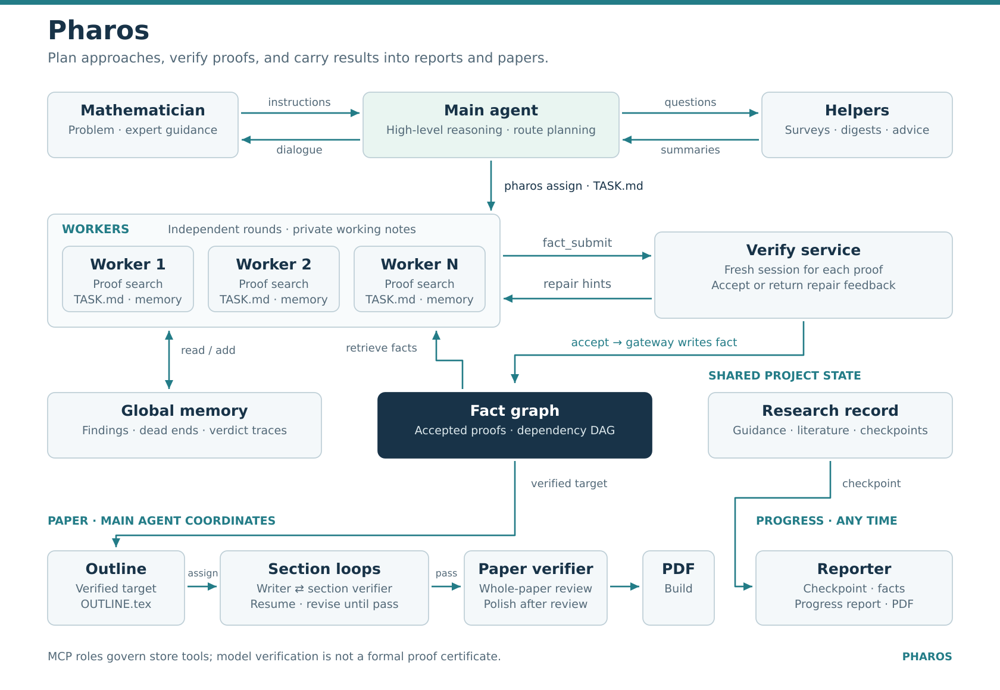

# Pharos

**Preview — under active development.**

Pharos is a mathematics research system for capable reasoning models such as
GPT-6 Astra. A project main
agent organizes research routes, workers develop proofs, and an independent
verifier checks submissions before they enter the shared fact graph.

- A repository-root operations session handles deployment and observes several
  projects, each with its own research team and records.
- A route board tracks approaches, evidence, obstacles, and worker assignments;
  supplied materials and expert guidance inform that board.
- Workers pursue substantial results across rounds, with files preserving their
  work; verified results support progress reports and a paper-writing workflow.

## Start and use

After [installation](docs/getting-started.md), run `codex` from the repository
root, or select that configured repository folder in the Codex desktop app.
Tell the operations session your problem, where your materials are, and what you
want to investigate; it prepares and launches the project with you.

Give research instructions to the project's main session and deployment requests
to the root operations session. See the [operating guide](docs/operating-guide.md)
for materials, progress reports, discussion, and papers.

## Documentation

- [Getting started](docs/getting-started.md) — installation and the first session.
- [Operating guide](docs/operating-guide.md) — working with a research project.
- [Architecture](docs/architecture.md) — roles, route boards, memory, and verification.
- [Operations](docs/operations.md) — services, stopping, recovery, and diagnostics.
- [Configuration](docs/configuration.md) — models and deployment settings.
- [CLI and tools](docs/cli-and-tools.md) — commands, MCP tools, and skill entry points.

Verification is a language-model judgment, not a formal proof certificate;
results intended for publication need human review.

## Acknowledgements

Pharos was developed and refined by Bin Dong, Guoxiong Gao, Jiedong Jiang,
Shurui Liu, Zeming Sun, and Bin Wu.

We thank Jihao Liu, Bohan Fang, Jingjun Han, Guchuan Li, Ruochuan Liu,
Yujie Luo, Zhenfu Wang, and Yijun Yuan for their feedback and suggestions
on Pharos.

## License and origins

Pharos inherits the worker–verifier and fact-graph core from
[Danus](https://github.com/frenzymath/Danus), and redesigns and extends
orchestration, project operations, and paper writing. Its proving skills build
on [Rethlas](https://github.com/frenzymath/Rethlas)
([paper](https://arxiv.org/abs/2604.03789)). The software uses the
[Apache License 2.0](LICENSE).
